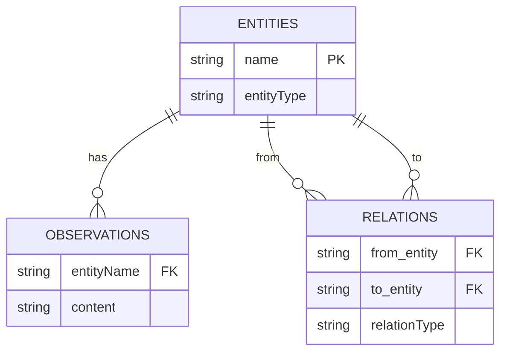

# MCP DuckDB Knowledge Graph Memory Server

[](https://github.com/izumisy/mcp-duckdb-memory-server/actions/workflows/test.yml)

A forked version of [the official Knowledge Graph Memory Server](https://github.com/modelcontextprotocol/servers/tree/main/src/memory).

## Motivation

This project enhances the original MCP Knowledge Graph Memory Server by replacing its backend with DuckDB.

### Why DuckDB?

The original MCP Knowledge Graph Memory Server used a JSON file as its data store and performed in-memory searches. While this approach works well for small datasets, it presents several challenges:

1. **Performance**: In-memory search performance degrades as the dataset grows
2. **Scalability**: Memory usage increases significantly when handling large numbers of entities and relations
3. **Query Flexibility**: Complex queries and conditional searches are difficult to implement
4. **Data Integrity**: Ensuring atomicity for transactions and CRUD operations is challenging

DuckDB was chosen to address these challenges:

- **Fast Query Processing**: DuckDB is optimized for analytical queries and performs well even with large datasets
- **SQL Interface**: Standard SQL can be used to execute complex queries easily
- **Transaction Support**: Supports transaction processing to maintain data integrity
- **Indexing Capabilities**: Allows creation of indexes to improve search performance
- **Embedded Database**: Works within the application without requiring an external database server

## Implementation Details

This implementation uses DuckDB as the backend storage system, focusing on two key aspects:

### Database Structure

The knowledge graph is stored in a relational database structure as shown below:



This schema design allows for efficient storage and retrieval of knowledge graph components while maintaining the relationships between entities, observations, and relations.

### Fuzzy Search Implementation

The implementation combines SQL queries with Fuse.js for flexible entity searching:

- DuckDB SQL queries retrieve the base data from the database
- Fuse.js provides fuzzy matching capabilities on top of the retrieved data
- This hybrid approach allows for both structured queries and flexible text matching
- Search results include both exact and partial matches, ranked by relevance

## Development

### Setup

```bash
pnpm install
```

### Testing

```bash
pnpm test
```
