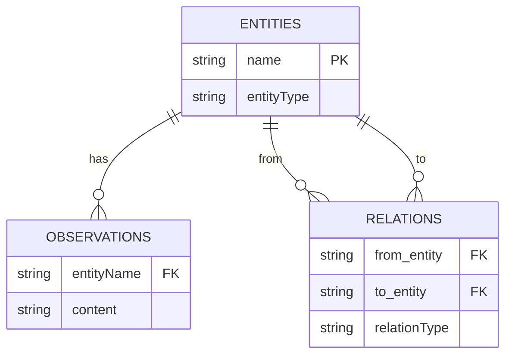

[](https://mseep.ai/app/izumisy-mcp-duckdb-memory-server)

# MCP DuckDB Knowledge Graph Memory Server

[](https://github.com/izumisy/mcp-duckdb-memory-server/actions/workflows/test.yml)
[](https://smithery.ai/server/@IzumiSy/mcp-duckdb-memory-server)


A forked version of [the official Knowledge Graph Memory Server](https://github.com/modelcontextprotocol/servers/tree/main/src/memory).

<a href="https://glama.ai/mcp/servers/4mqwh1toao">
  
</a>

## Installation

### Installing via Smithery

To install DuckDB Knowledge Graph Memory Server for Claude Desktop automatically via [Smithery](https://smithery.ai/server/@IzumiSy/mcp-duckdb-memory-server):

```bash
npx -y @smithery/cli install @IzumiSy/mcp-duckdb-memory-server --client claude
```

### Manual install

Otherwise, add `@IzumiSy/mcp-duckdb-memory-server` in your `claude_desktop_config.json` manually (`MEMORY_FILE_PATH` is optional)

```bash
{
  "mcpServers": {
    "graph-memory": {
      "command": "npx",
      "args": [
        "-y",
        "@izumisy/mcp-duckdb-memory-server"
      ],
      "env": {
        "MEMORY_FILE_PATH": "/path/to/your/memory.data"
      }
    }
  }
}
```

The data stored on that path is a DuckDB database file.

### Docker

Build

```bash
docker build -t mcp-duckdb-graph-memory .
```

Run

```bash
docker run -dit mcp-duckdb-graph-memory
```

## Usage

Use the example instruction below

```
Follow these steps for each interaction:

1. User Identification:
   - You should assume that you are interacting with default_user
   - If you have not identified default_user, proactively try to do so.

2. Memory Retrieval:
   - Always begin your chat by saying only "Remembering..." and search relevant information from your knowledge graph
   - Create a search query from user words, and search things from "memory". If nothing matches, try to break down words in the query at first ("A B" to "A" and "B" for example).
   - Always refer to your knowledge graph as your "memory"

3. Memory
   - While conversing with the user, be attentive to any new information that falls into these categories:
     a) Basic Identity (age, gender, location, job title, education level, etc.)
     b) Behaviors (interests, habits, etc.)
     c) Preferences (communication style, preferred language, etc.)
     d) Goals (goals, targets, aspirations, etc.)
     e) Relationships (personal and professional relationships up to 3 degrees of separation)

4. Memory Update:
   - If any new information was gathered during the interaction, update your memory as follows:
     a) Create entities for recurring organizations, people, and significant events
     b) Connect them to the current entities using relations
     b) Store facts about them as observations
```

## Motivation

This project enhances the original MCP Knowledge Graph Memory Server by replacing its backend with DuckDB.

### Why DuckDB?

The original MCP Knowledge Graph Memory Server used a JSON file as its data store and performed in-memory searches. While this approach works well for small datasets, it presents several challenges:

1. **Performance**: In-memory search performance degrades as the dataset grows
2. **Scalability**: Memory usage increases significantly when handling large numbers of entities and relations
3. **Query Flexibility**: Complex queries and conditional searches are difficult to implement
4. **Data Integrity**: Ensuring atomicity for transactions and CRUD operations is challenging

DuckDB was chosen to address these challenges:

- **Fast Query Processing**: DuckDB is optimized for analytical queries and performs well even with large datasets
- **SQL Interface**: Standard SQL can be used to execute complex queries easily
- **Transaction Support**: Supports transaction processing to maintain data integrity
- **Indexing Capabilities**: Allows creation of indexes to improve search performance
- **Embedded Database**: Works within the application without requiring an external database server

## Implementation Details

This implementation uses DuckDB as the backend storage system, focusing on two key aspects:

### Database Structure

The knowledge graph is stored in a relational database structure as shown below:



This schema design allows for efficient storage and retrieval of knowledge graph components while maintaining the relationships between entities, observations, and relations.

### Fuzzy Search Implementation

The implementation combines SQL queries with Fuse.js for flexible entity searching:

- DuckDB SQL queries retrieve the base data from the database
- Fuse.js provides fuzzy matching capabilities on top of the retrieved data
- This hybrid approach allows for both structured queries and flexible text matching
- Search results include both exact and partial matches, ranked by relevance

## Development

### Setup

```bash
pnpm install
```

### Testing

```bash
pnpm test
```

## License

This project is licensed under the MIT License - see the [LICENSE](LICENSE) file for details.
